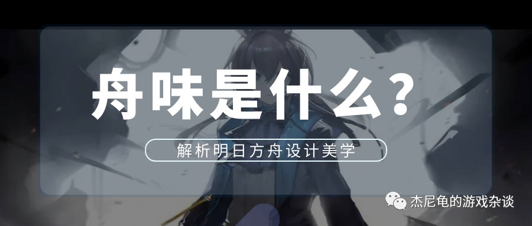
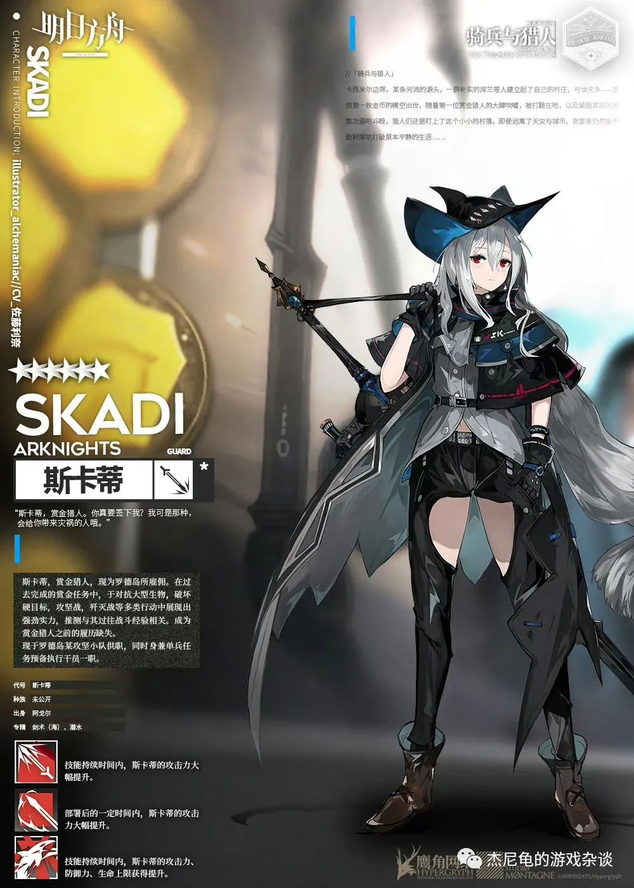
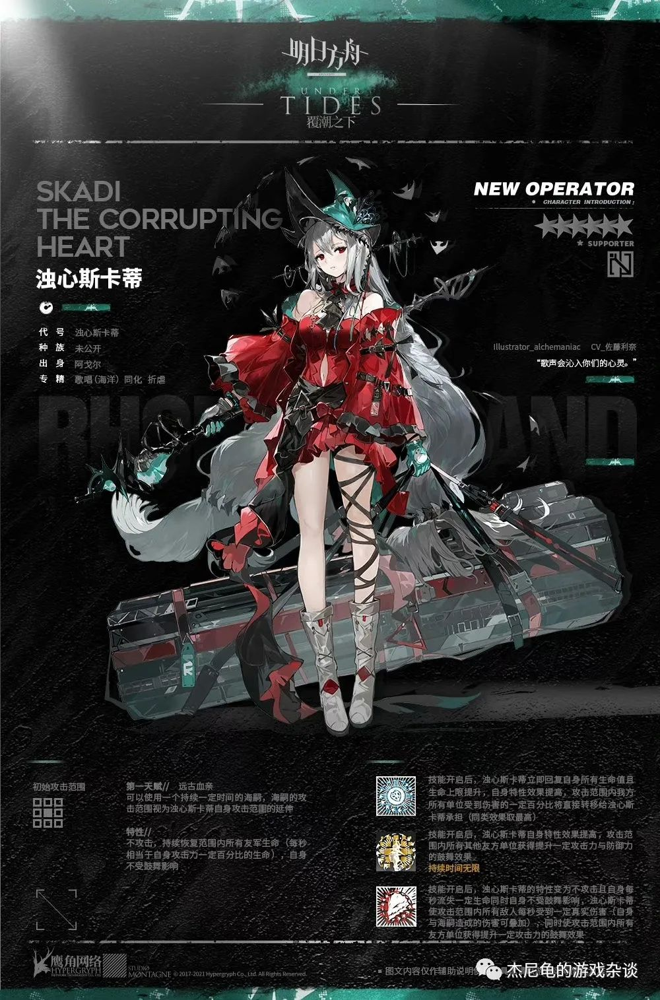
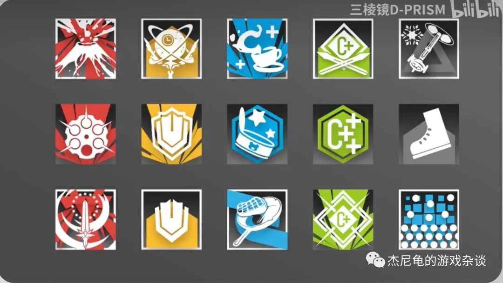
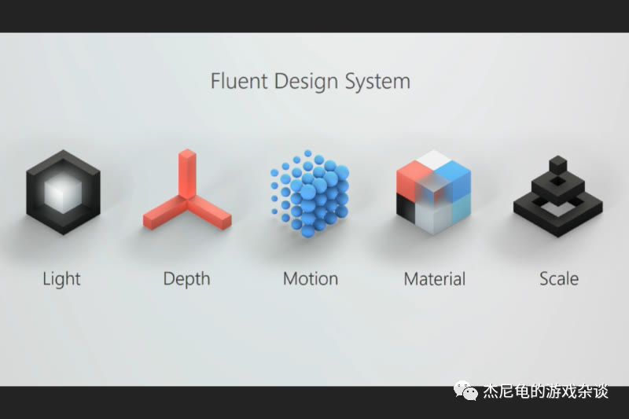
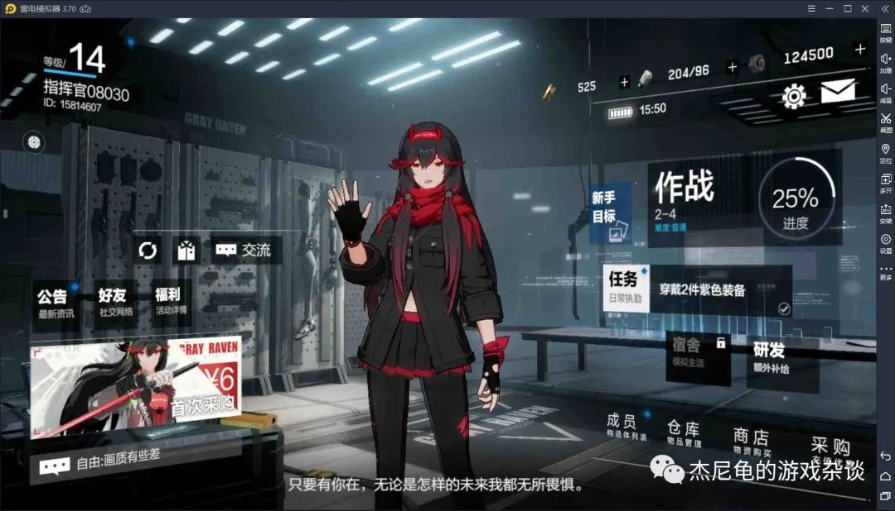
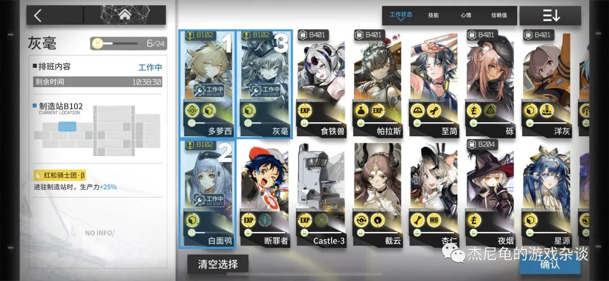
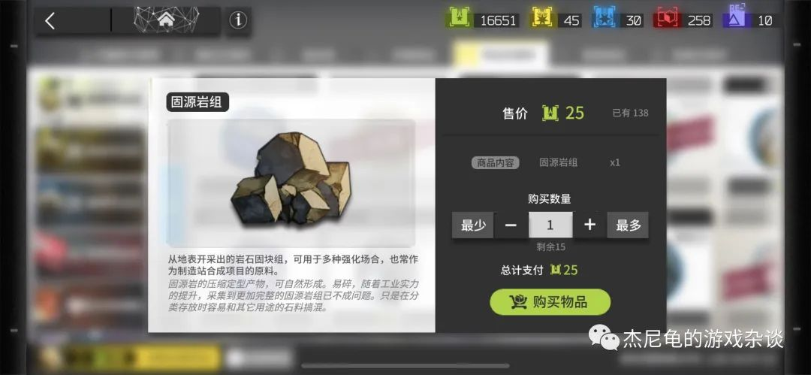
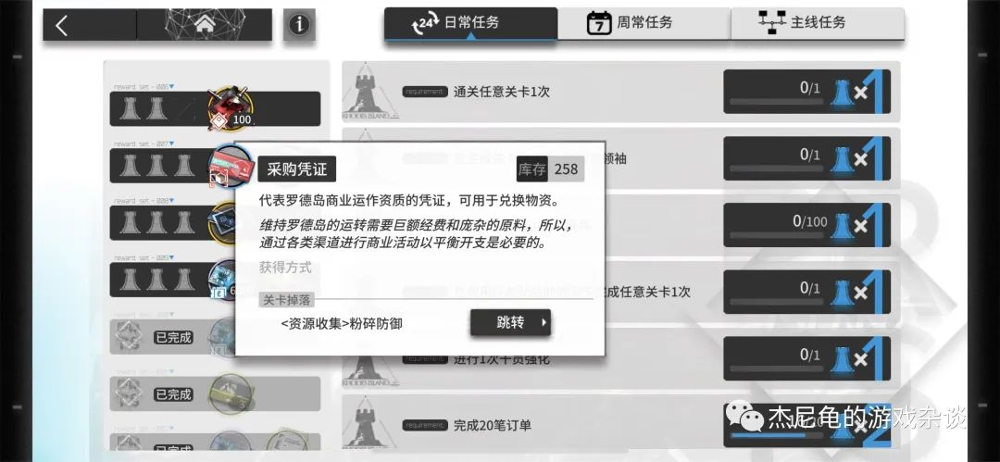

# "舟味"从何而来？解析明日方舟设计美学（UI/UX 设计篇）

> 作者：杰尼龟 · 杰尼龟的游戏杂谈 · 2023-09-18 发表于美国
> 来源：原文 PDF（[UIUX-analysis-for-Arknights.pdf](../UIUX-analysis-for-Arknights.pdf)）

自著名二次元手游《明日方舟》于 2019 年 5 月发布后，相信不少朋友都或多或少听说过"舟味"这个词。那么，舟味到底是什么呢？笔者想通过从各个角度解析明日方舟设计美学，来帮助各位读者更全面和深入地了解"舟味"。今天，我们就先来分析明日方舟最受到业界好评的 UI/UX 设计。

> Since the release of the famous 2D mobile game "Arknights" in May 2019, many friends have probably heard of the term "舟味" to varying degrees. So, what exactly is "舟味" (Arknights Style)? The author intends to help readers gain a more comprehensive and in-depth understanding of "舟味" by analyzing the design aesthetics of Arknights from various angles. Today, let's start by analyzing the highly praised UI/UX design of Arknights.

---

## 01. 高度统一的设计规范，造就舟味的基础

> *Highly Unified Design Standards: The Foundation of "Arknights Style"*

UI 设计（User Interface Design）即用户界面设计，是指对软件的人机交互、操作逻辑、界面美观的整体设计；UX 设计（User Experience Design）即用户体验设计，其核心是用户，体验指用户在使用产品以及与产品发生交互时出现的主观感受和需求满足。这二者相辅相成，密不可分。舟味的形成，与明日方舟一直以来高度统一的 UI/UX 设计规范息息相关。

> UI design (User Interface Design) refers to the overall design of a software's user interface, including human-computer interaction, operation logic, and interface aesthetics. UX design (User Experience Design), on the other hand, focuses on the user's subjective feelings and satisfaction when using a product and interacting with it. These two aspects complement each other and are closely intertwined. The formation of "Arknights Style" is closely related to Arknights' consistently high level of unified UI/UX design standards.

B 站 up 主"三棱镜 D-PRISM"主张，在宏观上，舟味是"对一张设计，或一款产品中的字体、字重、配色、元素，甚至 Icon（图标）进行严格的约束，由此形成的一套规则"。而"设计规范的重点在于，一致。且对于同样内容的视觉表现形式，在过去以及未来都要是一致的。"

> Bilibili up "三棱镜 D-PRISM" argues that, on a macro level, "Arknights Style" is "a set of rules formed by strict constraints on fonts, font weights, color schemes, elements, and even icons in a design or a product." The key to design standards is consistency. Visual representations of the same content must remain consistent in the past and the future.

以干员介绍图为例。这是明日方舟 2019 年 5 月的干员介绍图：

> Take the example of operator introduction images. Here is an operator introduction image from Arknights in May 2019:

这是 2021 年 4 月的干员介绍图：

> And here is an operator introduction image from April 2021:

两图对比不难发现，虽然明日方舟在 UI 的设计风格上有了很大的变化，但是视觉规范却是始终如一的。比如，干员代号全部为思源黑体，字重 Heavy，字间距 -100；基础档案信息为左右结构，全部为思源黑体，字重 Normal，字间距 -100；技能介绍左对齐到技能图标右侧，全部为思源黑体，字重 Normal，字间距为 0。

> It's easy to see the visual consistency in Arknights' design, even though the UI design style has evolved significantly. For example, operator code names are all in Source Han Sans, Heavy font weight, and -100 letter spacing; basic profile information follows a left-right structure, all in Source Han Sans, Normal font weight, and -100 letter spacing; skill descriptions align left to the right of the skill icons, all in Source Han Sans, Normal font weight, and 0 letter spacing.

再以技能图标为例。技能图标一共有五种颜色，大致区分了不同类型的增益。有的有边框，有的没有，为的是区分主动技能和被动技能。背景图案的不同，则是具体区分了技能的类型，增益减益，爆发和生存等。

> Let's take skill icons as another example. Skill icons come in five different colors, roughly distinguishing different types of effects. Some have borders, while others do not, to differentiate between active and passive skills. Differences in background patterns specifically categorize the skill types, such as enhancement, debuff, burst, and survival.

从以上的例子。我们不难感受到，虽然方舟一直在对自己的设计风格进行迭代和优化，但是 UI 的组成部分以及参数方面的要求始终都是高度统一的。正因为如此，方舟的设计才能具有高识别度，让人一看就觉得有"舟味"。

> From these examples, it's clear that while Arknights continually iterates and optimizes its design style, the components and parameter requirements of the UI remain highly unified. This consistency is what gives Arknights its high recognizability and the distinct "Arknights Style."

---

## 02. 简洁却又不失深度：Fluent Design 对方舟设计美学与交互的影响

> *Simplicity with Depth: The Impact of Fluent Design on Arknights' Design Aesthetics and Interaction*

Fluent Design 是微软在 2017 年提出的设计系统，这套设计系统据称将为其产品视觉提供贯穿多平台的能力，并对当时分散在多个大产品中的零碎的设计风格进行收束。整个设计风格被拆解成以下五个方面：Light 光效，Depth 视差，Motion 动效，Material 材质，Scale 比例。

> Fluent Design is a design system introduced by Microsoft in 2017. This design system aims to provide a consistent visual experience across multiple platforms and unify fragmented design styles found in various Microsoft products. Fluent Design consists of five key elements: Light, Depth, Motion, Material, and Scale.

### Light（光效）

光效在流畅设计体系中，作为突出互动控件状态的反馈存在，不过因为方舟作为一款手游，通过触控而非鼠标指针作为交互方式，因此对光效这一元素的运用仅停留在少部分静态界面上。目前游戏内所有对打光有刻意表现的地方多用静态贴图而非即时渲染（例如签到日历的背光效果、得到材料奖励时的背后光圈）。

> In the Fluent Design system, light is used to highlight the state of interactive elements. However, since Arknights is a mobile game with touch-based interactions rather than a mouse pointer, the use of lighting effects is limited to certain static interfaces. Currently, all instances of emphasized lighting effects in the game are achieved through static textures rather than real-time rendering (e.g., the backlight effect on the daily login calendar or the halo effect when receiving materials as rewards).

### Depth（视差）与 Scale（比例）

自从 Material Design 和 iOS 11 推出以来，一种广泛认知的设计风格是将元素呈现为卡片形状，同时添加了轻微的阴影和圆角。这种设计风格在明日方舟的许多地方都有使用，如采购中心和基础建设页面。卡片设计搭配阴影的目的是为了创建层次感，简单来说，如果一个元素需要引起用户的注意，就会让它更接近用户，同时在界面上的可见高度也会增加。这是突出页面深度的一种方式，符合扁平化设计的原则。

> Since the introduction of Material Design and iOS 11, a widely recognized design style involves presenting elements as cards with slight shadows and rounded corners. This design style is used in various parts of Arknights, such as the procurement center and infrastructure development pages. The purpose of the card design, along with shadows, is to create a sense of hierarchy. In simple terms, elements that need to catch the user's attention are brought closer to the user, increasing their visible height on the interface. This approach highlights depth on the page and aligns with the principles of flat design.

也有许多其他游戏在模仿明日方舟 UI 设计的视差，但是都没有方舟的效果好。比如，战双帕弥什的主界面虽然和明日方舟很相似，但是很明显给人一种"太平了"的感觉。这是因为每个区块都缺乏阴影，因此没有深度和层次感。区块的大小比例、颜色也十分相似，缺少视觉重点。同时，方舟在细节方面做得也很到位，看板的每个区块都配上了对应功能的 icon。用户对于图形的学习能力远大于文字，方舟就是通过对于图标细节的打磨来不断完善用户体验。

> Many other games have tried to imitate Arknights' UI design with depth effects, but none have achieved the same level of success. For example, the main interface of "Punishing: Gray Raven" is quite similar to Arknights, but it gives a "too flat" impression. This is because every element lacks shadows, resulting in a lack of depth and hierarchy. The size ratios and colors of the elements are very similar, lacking visual focal points. Arknights pays great attention to detail, ensuring that each section of the user interface is accompanied by corresponding icons representing its functionality. Users have a much greater ability to learn from graphics than from text, and Arknights continuously improves the user experience by refining the details of its icons.

*战双的设计给人感觉"太平了"*

*方舟对于每个干员基建加成的能力都有专门的图标设计*

### Material（材质）

在众多的设计元素中，微软自 Windows 7 时代以来一直非常喜欢使用的是毛玻璃（Frosted Glass）。这个选择的原因很明显：在不同光线和物体叠加的情况下，毛玻璃所呈现的"背景模糊"效果不同于普通的渐变，它的色彩过渡更加柔和，可以与画面中的锐化部分形成鲜明的对比。在 Fluent 系统中，背景模糊仍然在界面样式中扮演着重要的角色，但进一步演化成了"亚克力材料"风格，通过模拟亚克力板的外观来构建视觉层次。

> Among the various design elements, Microsoft has long favored the use of frosted glass in its designs, dating back to Windows 7. Frosted glass is chosen because it creates a "background blur" effect that differs from ordinary gradients under varying lighting conditions and overlapping objects. In the Fluent system, background blur still plays an important role in interface styles but has evolved into a "acrylic material" style, simulating the appearance of acrylic sheets to construct visual layers.

方舟的用户界面有一个显著的特点，即层级对比度非常高。这不仅因为它采用了高质量的平面设计理念和与游戏世界观相符的醒目亮色，还因为它在多个地方使用了背景模糊效果，以突出需要关注的交互部分。另一个背景模糊的好处是它的遮挡效果：通过在特定界面上应用背景模糊，然后在其上添加新的页面元素，可以让玩家"窥见"之前的页面被覆盖在下方。

> Arknights' user interface has a notable feature: a high level of contrast in hierarchy. This is not only because it adopts high-quality flat design principles and vivid colors consistent with the game's world, but also because it uses background blur effects in many places to emphasize the interactive parts. Another benefit of background blur is its masking effect: by applying background blur to specific interfaces and then adding new page elements on top, players can "peek" at the previous page that is covered underneath.

*方舟在多个地方使用了背景模糊效果，以突出需要关注的交互部分*

### Motion（动效）

在流畅设计体系中，"动效"是通过连接动画（Connected Animation）和协调动画（Coordinated Animation）来平滑过渡不同界面之间的变化，以保持内容的连续性和层级关系。协调动画的核心形式是"移动"，它使用户所选择的元素在某个方向上产生位移，并在下一个级别的某个位置显示出来。在游戏中，出色的动画也可以减少由于界面切换而引起的断裂感，从而保持游戏体验的连贯流畅性。

> In the Fluent Design system, "motion" smooths transitions between different interfaces by connecting animations (Connected Animation) and coordinating animations (Coordinated Animation) to maintain continuity and hierarchy in content. The core form of coordinated animation is "movement," which causes selected elements to move in a specific direction and appear at a certain position in the next level. In games, excellent animations can reduce the sense of disruption caused by interface changes, ensuring a smooth gaming experience.

方舟在这方面做得非常出色，通过动画效果成功地增强了游戏体验。在基建系统中，它采用了衔接动画的方式，而在干员页面中，包括人物描述、升阶和合卡等方面，都使用了协调动画。此外，在不同界面之间的切换也没有采用突兀的"硬切"效果，而是采用了平滑的渐入渐出动画，从而使整个游戏过程更加连贯和流畅。

> Arknights excels in this regard by enhancing the gaming experience through animation effects. In the infrastructure system, it uses connecting animations, while in operator pages, including character descriptions, promotions, and potential upgrades, it employs coordinated animations. Furthermore, transitions between different interfaces do not use abrupt "hard cuts" but instead use smooth fade-in and fade-out animations, making the entire gaming experience more seamless and fluid.

---

## 03. 轻松上手方舟，原来是因为 UX 设计大大降低了用户的学习量

> *Easy to Pick Up Arknights: Thanks to UX Design Significantly Reducing the Learning Curve for Users*

对于任何一个稍微复杂一些的游戏，新手引导部分都是十分困难的。如何让一个刚接触游戏的玩家快速认知游戏的功能和玩法？明日方舟在这方面可谓是二游界的教科书。

> For any somewhat complex game, the new player tutorial section is often quite challenging. How can a player who has just started the game quickly grasp its features and gameplay? Arknights is a textbook example in the gaming world in this regard.

在前文的 Motion（动效）部分提到过，方舟在每次需要进行页面切换的情况下都引入了过渡动画，并根据页面之间的逻辑特点有针对性地选择了不同的动画效果。例如，当切换两个较为独立的系统时，会使用简单的深色淡出效果，而在具有逻辑联系的关卡主题和关卡选择之间，则会使用明显的 "zoom-in" 和 "zoom-out" 效果。此外，在进入需要加载资源时间较长的系统（如基建）时，除了动画效果外，还会展示插画，以减少玩家的感知等待时间。

> As mentioned in the Motion section earlier, Arknights introduces transition animations whenever a page switch is required, selectively choosing different animation effects based on the logical characteristics between pages. For example, when switching between two relatively independent systems, a simple dark fade-out effect is used, while clear "zoom-in" and "zoom-out" effects are used between levels with logical connections, such as campaign themes and level selection. Additionally, when entering systems that require longer resource loading times, such as infrastructure, apart from animation effects, illustrations are displayed to reduce the player's perception of waiting time.

方舟还大量使用了毛玻璃背景模糊效果，用于降低玩家对突然出现的新页面的抗拒感。一些次要系统会直接以覆盖原有页面的方式呈现，如签到、邮件、通知、设置等页面。而在基建系统中，通过设施的主题色来增强页面之间的从属关系。

> Arknights also extensively uses frosted glass background blur effects to reduce player resistance to suddenly appearing new pages. Some secondary systems are presented directly by overlaying the original page, such as check-in, mail, notifications, and settings pages. In the infrastructure system, the use of facility theme colors reinforces the hierarchy between pages.

除了浮窗效果，局部元素的位移也常用于简化信息层级的交互方式。典型的例子是干员的养成页面，其中每个可点击的按钮都不会将玩家带到全新的页面，而是保持与干员信息页的联系。例如，升级会有横向淡入动画，升阶和合卡会有人物位移效果，而升技能则保持页面背景不变。这种设计还包括了弹出透明浮窗、毛玻璃弹窗、数字向右展开等方式，以及页面拖拽滑动可以直接实现干员的切换。所有这些元素的融合让玩家在复杂的养成系统中一直都感觉像停留在同一个画布上，这被认为是《方舟》交互设计的一个杰出示范。

> In addition to floating effects, the displacement of localized elements is also commonly used to simplify the interaction of information hierarchy. A typical example is the operator's development page, where each clickable button does not take the player to an entirely new page but maintains a connection with the operator information page. For example, upgrading has a horizontal fade-in animation, while promotions and trust rank upgrades involve character movement effects, and skill upgrades keep the page background unchanged. This design includes transparent pop-up windows, frosted glass pop-ups, expanding numbers, and drag-and-drop scrolling to switch between operators. The integration of all these elements makes players feel like they are always on the same canvas in a complex development system, which is considered an excellent demonstration of Arknights' interaction design.

除此之外，方舟的系统导航也设计得十分精妙，大大减少了用户的学习量。很多玩家会因为游戏的材料过多过于复杂而被劝退。为了解决这一点，方舟采用了全局指示链功能。这意味着在任何一个物品的图标出现的地方，玩家可以直接查看物品的详细信息，包括它的掉落关卡和掉落几率。这种组件化的设计大大降低了玩家学习养成科技树的难度，甚至在完全了解材料层级关系之前，玩家就可以开始进行物品的收集和养成。

> Furthermore, Arknights' system navigation is cleverly designed, significantly reducing the learning curve for users. Many players can be discouraged by games with overly complex and numerous materials. To address this, Arknights introduces a global indicator chain feature. This means that wherever an item's icon appears, players can directly view detailed information about the item, including the stages where it drops and its drop rate. This modular design greatly reduces the difficulty for players to learn the technology tree, and players can start collecting and developing items even before fully understanding the material hierarchy.

*在任何一个物品的图标出现的地方，玩家可以直接查看物品的详细信息，包括它的掉落关卡和掉落几率*

方舟主界面按钮的功能也设计得十分用户友好。这些按钮允许玩家快速进入游戏中的任何一个系统，而无需经过繁琐的返回面板再进入。这个导航栏的独特之处在于，它并不是零散的，而是按照在建立在倒悬鲸骨之上的「方舟」的不同区域来组织的。这种将各个系统放置在游戏世界中不同的区域的方式，赋予了这些系统一种空间上的联系和包装感。这使玩家的交互路径更具代入感，有助于创造深度的游戏体验。

> Arknights' main interface buttons are also user-friendly. These buttons allow players to quickly access any system in the game without going through cumbersome return panels. What sets this navigation bar apart is that it's not fragmented; it's organized based on different regions within the "Arknights" established on the suspended whale bone. Placing various systems in different regions of the game world gives these systems a spatial connection and a sense of packaging. This makes the player's interaction path more immersive, contributing to a deep gaming experience.

---

## 04. 结语

> *Conclusion*

《明日方舟》是手游领域内非常罕见、有着极高美术质感追求和高度统一视觉规范标准的产品。在它"爆冷"的背后，实际上孕育着无数设计师的心血。

> "Arknights" is a rare product in the mobile game industry that pursues high-quality art and a highly unified visual standard. Behind its "unexpected success," countless designers have put their hearts into it.

当今，国内游戏的 UI 尤其是 UE 设计还处于比较边缘的情况，除了少数大公司，极少设置 UE 职位而直接由策划兼任，游戏 UI/UE 设计作为链接玩家和游戏内核的纽带，甚至连可供参考的中文专业书籍都没有，足见游戏 UE 设计地位之尴尬。殊不知，UI/UE 是提升玩家体验，增加玩家粘度必不可少的一环。许多游戏也许拥有精良的美术和高超的技术，但却留不住玩家，很多时候都是因为用户体验过差。明日方舟对于 UI/UE 的至高追求，想必会提升国内手游界对于此方面的重视，也同时会大大激励想在相关行业发光发热的游戏从业者。

> Today, UI/UX design in the Chinese gaming industry, especially UE design, is still relatively on the fringe. Apart from a few large companies, very few have dedicated UE positions, and often, designers double as planners. UI/UX design, as the link between players and the core of the game, is essential for improving the player experience and increasing player retention. Many games may have excellent art and technical prowess, but they fail to retain players due to poor user experiences. Arknights' relentless pursuit of UI/UX is likely to raise awareness of the importance of this aspect in the domestic mobile game industry and inspire game professionals to shine in related fields.

---

## References

- 《我特么吹爆——从设计专业学生角度看《明日方舟》UI/UE 设计》Banthem，Bilibili，2019。<https://www.bilibili.com/read/cv3235300/>
- 《从 6 个角度拆解：为什么说《明日方舟》的视觉细节既好看，又先进？》腾讯游戏学堂，机核网，2019。<https://www.gcores.com/articles/112810>
- 《舟味是什么？【第一期】》三棱镜 D-PRISM，Bilibili，2021。<https://www.bilibili.com/video/BV1hL4y1p7Md/>

> 文章已于 2023-09-18 修改
