# 产品《明日方舟》UI/UX 分析——藏在「好看」背后的先进性

> 作者：AJ · 游戏运营 · 腾讯互娱 互动娱乐发行线
> 来源：<https://gameinstitute.qq.com/article/10027>

《明日方舟》**（后文简称「方舟」）** 上线至今已经超过两个月，其突出的美术风格和国内游戏罕见的世界观题材、为重度二次元玩家和塔防策略爱好者都津津乐道的战斗玩法，行业内外许多前辈都纷纷给出了不同的解读和评析。

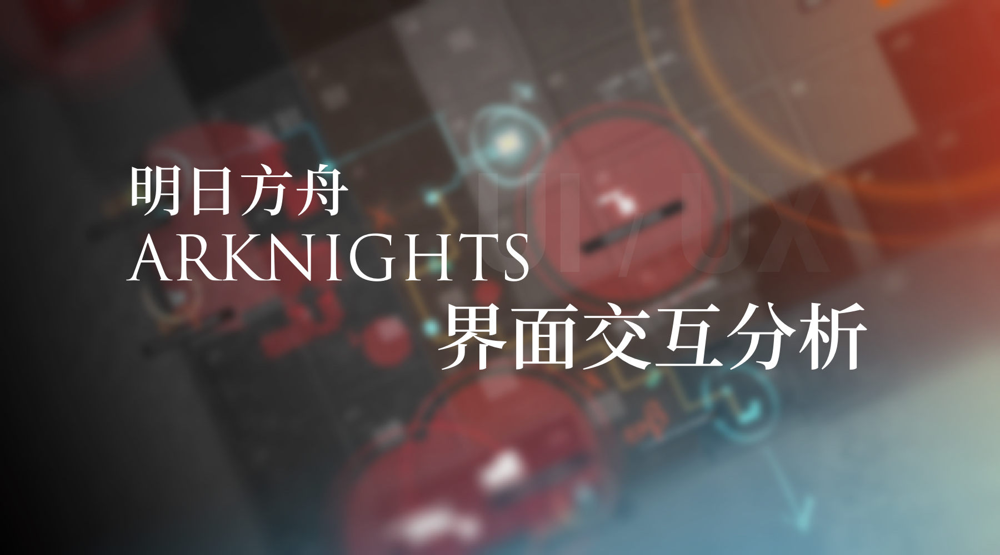

但对于笔者来说，第一次通过 PRTS 接入罗德岛时最为眼前一亮的，却是它的 UI —— 它唤醒了我对于很多游戏的记忆和一些设计风格的怀旧。随着游戏体验的深入，方舟的页面交互与其扎实的平面设计功底深得我心，因而决定动笔记录，分享一下对方舟在界面设计层面的部分认知和思考。

我将从以下 6 个不同的角度分析方舟 UI/UX 的特点，中间穿插较多的对比与发散，因而描述重点时而会跳出方舟本身，**部分内容涉及动效、氛围、美术和外延话题的探讨，可能超出了页面与交互的定义范围，笔者会尽可能地保证延伸都有一定的基准点。** 这六点是：

  * > Diegetic Interface 风格的主看板观瞄投影设计如何增强沉浸感？

  * > 类 Fluent Design 设计思想的多元质感在哪些细节中勾勒？

  * > 界面扁平化后如何追求交互空间和所承载内容的深度？

  * > 风格化的装饰字体如何同时成功地表达古典骑士精神与科幻军工风？

  * > 焦距控制和底图处理等平面设计基础手法如何塑造统一的视觉识别？

  * > 有哪些过场衔接技巧降低了页面层级的数量，并构建了场景化的系统结构？

> 最后，笔者会分享一些在游戏过程中的有趣发现，并浅谈个人对于方舟的页面与交互未来的展望。

# **一. Diegetic Interface 风格的主看板观瞄投影设计如何增强沉浸感？**

与「画内界面」相对应的是「画外界面」，如果这个词比较陌生，那「画外音」肯定是我们日常所熟知的影像元素。**所谓画外，即场景中的某个信息单元仅仅呈现给观众（玩家），而非呈现给剧中的角色。** 在多数游戏界面中，用来向玩家展现其所需要时刻知晓的信息的界面通常以 HUD（Heads-up Display）的方式出现，例如格斗游戏《拳王》中双方的血量条、怒气值等组件。

与之相反，「画内界面」则试图把画面中角色所能够看到的信息以相同的方式展现给玩家，从而打破玩家和游戏角色「隔着一个屏幕」的舒适区，增强沉浸感。

最近比较印象深刻的例子是《Apex 英雄》中枪械的弹药数指示方式，其并不像大多数 FPS 游戏一样出现在一个单独的角落方块内，而是显示在在每一把枪支瞄镜侧方的弹药状态面板上。不同的枪支屏幕面板不同，子弹的指示方式成为了枪支特性之一。另一个案例是《生化危机》，困难模式下角色的血量通过屏幕的整个颜色和视野模糊程度来指示，受伤情况越严重越看不清楚，加上摇晃力度变大，模拟了角色的真实体征。

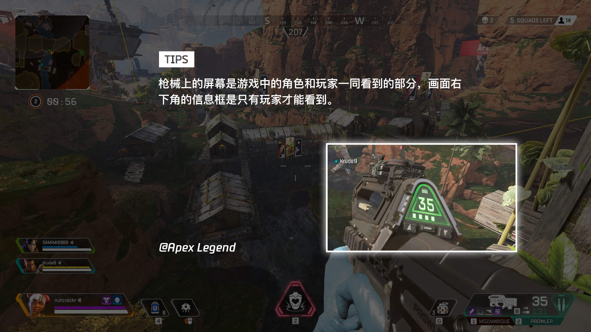

方舟中出现画内界面的案例并不多，但最为直观也最为大家熟悉的就是游戏的主看板了。根据剧情，博士第一次操作岛内事务的时候，人并不身处罗德岛中，而是通过一个名为 PRTS（Prmitive Rhodesisland Terminal Service）的系统进行远程接入，所以通过一个仿若钢铁侠头盔内的漂浮投影界面很好地突出了这种状态。

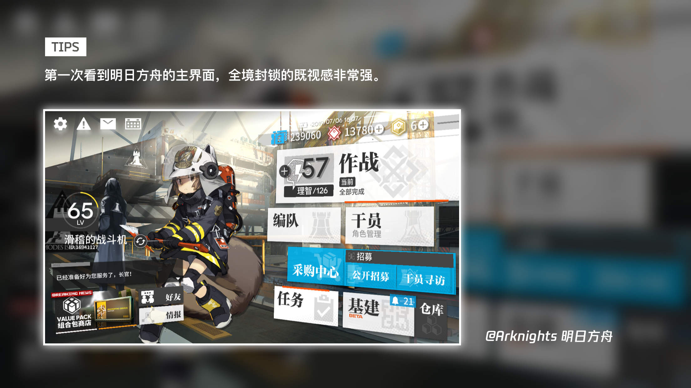

这个界面实在是和《全境封锁》中角色的物品栏界面如出一辙，**全息投影、虚拟指示窗、高科技的观瞄设备，这些元素和后启示录科幻战争联想有着密不可分的关系，而方舟在题材上的共通成为了这种设计契合的原因。** 当手机设备的电量、信号和时间信息都被按照统一风格放入了对应的浮窗中，并且随着陀螺仪的感应整体移动 —— 方舟在一开始就为玩家提供了强大的沉浸感。

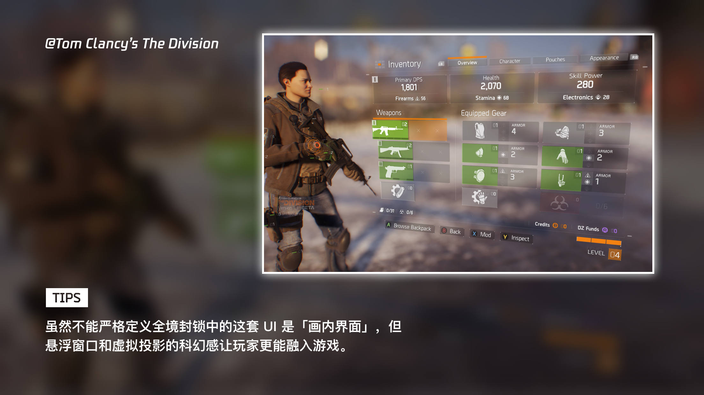

当然，作为一款二次元养成战略手游，它的几个系统本身带有分隔，且在小屏幕上对于可用性的关注远在美学之上，画内界面元素的表现并不能和端游大作相提并论。关于 Diegetic Interface，笔者最初是从 EA 的《死亡空间》中深刻体会到的，在 2013 年的 GDC 上，EA Visceral Games 的时任 UI 总监 Dino Ignacio [**详细地展示了游戏初期的开发历程** ，**探究了各种团队为了提供更多画面沉浸感的尝试，并对 Skeuomorphs****（拟物）的概念如何贯穿游戏 UI****设计进行了深入的分析**](<https://www.gdcvault.com/play/1017723/Crafting-Destruction-The-Evolution-of>)。关于这一点，后文也会简单提到。

* * *

# **二. 类 Fluent Design 设计思想的多元质感在哪些细节中勾勒？**

Fluent Design 是微软在 2017 年提出的设计系统，这套设计系统据称将为其产品视觉提供贯穿多平台的能力，并对当时分散在多个大产品中的零碎的设计风格进行收束。

在最初的介绍视频中，整个设计风格被拆解成以下五个方面：Light 光线，Depth 深度，Motion 动作，Material 材质，Scale 比例。通过 Specs 指引，我们可以知道每个分类在底层系统设计上的具体意义；但就我个人理解来说，**它在视觉上的本质表现是对「拟物」的简化，核心是「质感」。**

如何设计一个 Fluent 的元素？首先找到这一元素在现实世界中最具有代表性的材质，重现这一种材质的纹理，剥离这种纹理的细部表现，最后加入光照的变化和交互时的强调方式。到此为止，一个基础 Fluent 组件的视觉呈现便设计完成了。

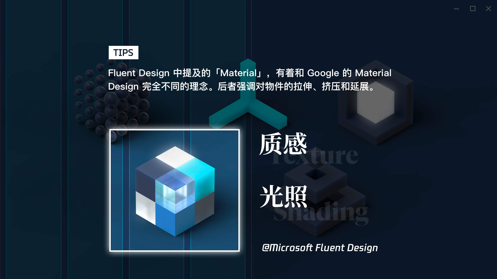

在众多的材料选择中，微软从 Windows 7 时代开始便极其偏好的要素是毛玻璃（Frosted Glass），理由显而易见：在不同的光线环境和物品重叠下，其所代表的「背景模糊」效果不同于一般的渐变，**色彩结合更加柔和，能够和画面中锐化过的部分（如正文）产生鲜明的对比** 。在 Fluent 系统中，背景模糊仍然在面板样式层面扮演了重要的角色，不过进一步被改进成了「亚克力材料」（Acrylic Material）风格，通过对亚力克板的仿真来构建视觉层级。

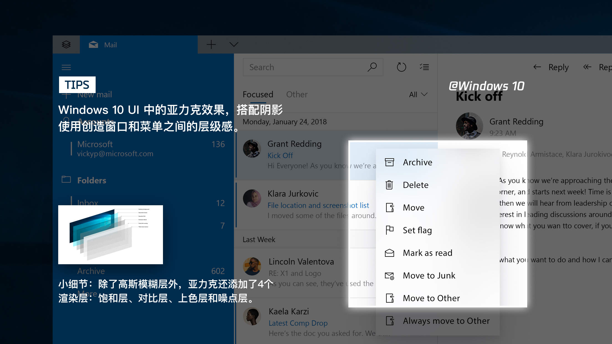

方舟的 UI 一个突出特点就是层级对比度极高，这里除了有高质量的平面设计思想和符合世界观的警戒亮色加持之外，多处使用背景模糊效果来突出画面需要关注的交互部分也是原因之一。**背景模糊的另外一个好处是它的覆盖特性** ：对一个特定界面进行背景模糊，再在其上加入新的页面组件，可以让玩家「窥」见之前的页面被覆盖在了下方。关于这点，后文会再次提到。

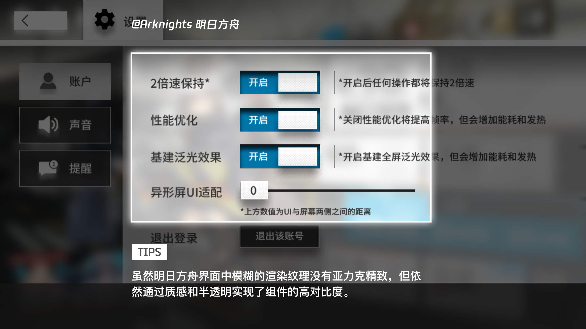

前面举例如何创作一个 Fluent 组件时，叙述了笔者「提取材质，剥离细部」的核心思路，这样的结果其实是物件的「积木化」：积木作为孩童的启蒙玩具，**需要承担让认知的功能（辨识度），同时又必须保持其可玩性的特点。** 关于美术层面的质感追求，[日本画师 **@****池上幸輝** 稍早之前公布了一组自己的练手稿](<https://twitter.com/winter_parasol/status/1131401145891483649>)，充分体现了材质之间核心差异感的魅力。

最后提一下 UI 上光线的使用。由于方舟是一款手游，因此交互上没有办法做指针悬停效果，在光线控制上除了用陀螺仪似乎没有太多的想象空间。目前游戏内所有对打光有刻意表现的地方多用静态贴图而非即时渲染（例如签到日历的背光效果、得到材料奖励时的背后光圈），期待以后有更多产品**能够在****UI****层面就开始考虑 shading & lighting ****这些原本在建模阶段才会考虑的元素，界面更好的表现能力意味着更丰富的操作引导可能性。**

**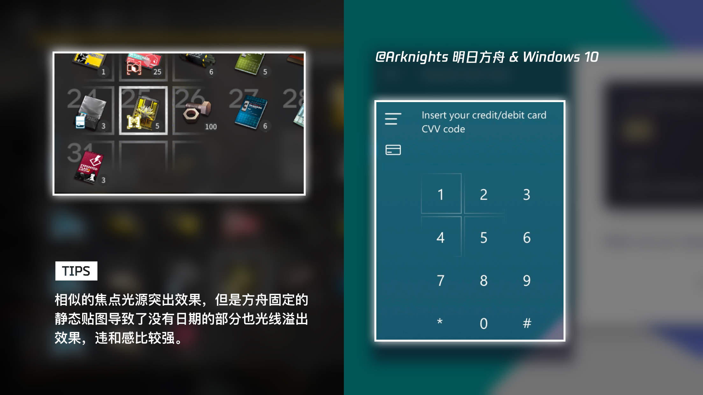**

* * *

# **三. 界面扁平化后如何追求交互空间和所承载内容的深度？**

开个玩笑，微软刻意强调 Fluent 系统中的 Depth 深度与 Scale 比例这两个元素，其实无非是之前整个 Windows 的系统级界面都太平了 —— 这成为了扁平化最大的误区：**扁平的出发点是减少页面中和交互无关的细节，提升产品使用效率，并且加强设计元素的视觉统一性。** 如果单纯理解为「平」，就会导致用户学习成本增高和画面失焦的后果。

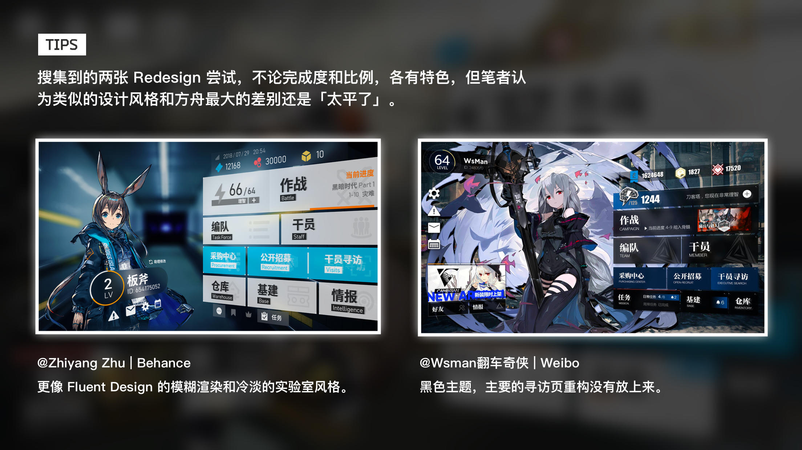

从 Material Design 的概念被提出和 iOS 11 推出开始，扁平化设计三板斧「卡片阴影加圆角」广为人知，方舟没有逃出囹圄，在采购中心、基建等不少页面出都使用了卡片设计。卡片搭配阴影的目的是形成层级，简而言之，越要抓住用户的元素，就摆得离其越近，在界面图层上相对应的高度也就升高。这是扁平化凸显页面深度的方法之一。

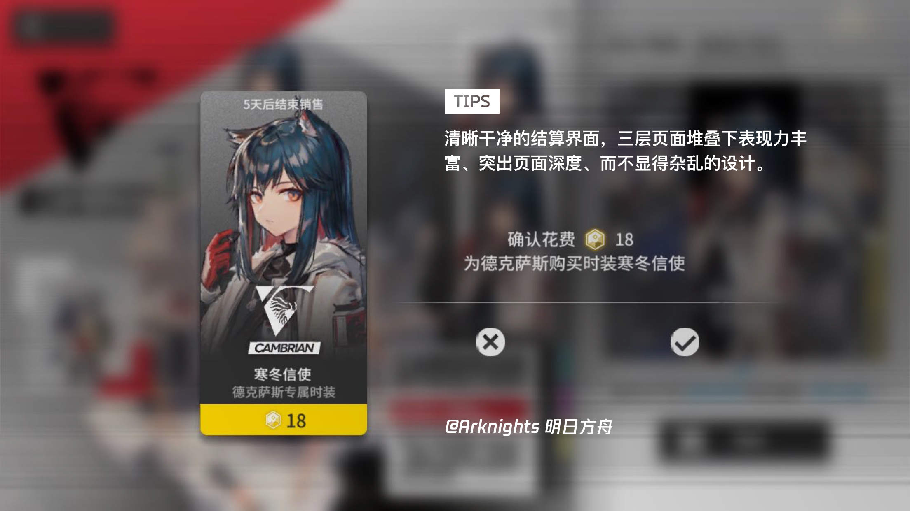

在作战章节选择的界面中，加了粗白边框的章节主题图仿佛打印出来的相片一样被夹在细绳上，如果仔细观察，可以发现一圈内投影布于页面周围。这种在摄影领域被称为 **vignette effect** 的效果最初来源于因遮光物或者透镜排布问题而导致的影像中心的明度和饱和度比四周高的情况，也称为「热点效应」。**现代平面设计中多作为一种创意效果加入到画面中，以此来突出页面中心的信息。** 这个设计实际还存在于方舟的多个页面，通过这种方式来突出页面中的卡片元素，视觉层级清楚分明。

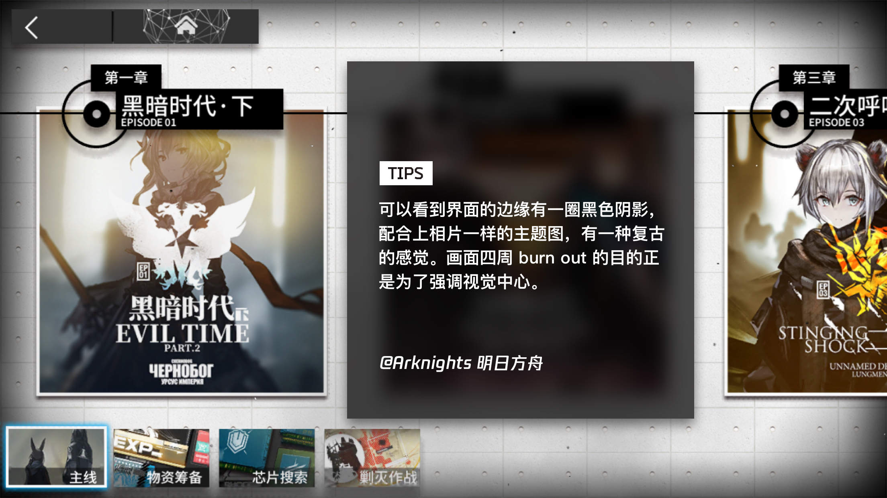

在寻访界面中加入的视差效果也是亮点之一，干员本身有大小区别（暗示远近）的情况下，加入视差可以让透视感成型，这和整体的平面设计要素是一脉相承的，可以说非常走心。当然，笔者认为这里还可以用骨骼动画 + 粒子效果的美术加持让每次主打的某位干员更加突出，复现预热宣传 pv 里面的样式。

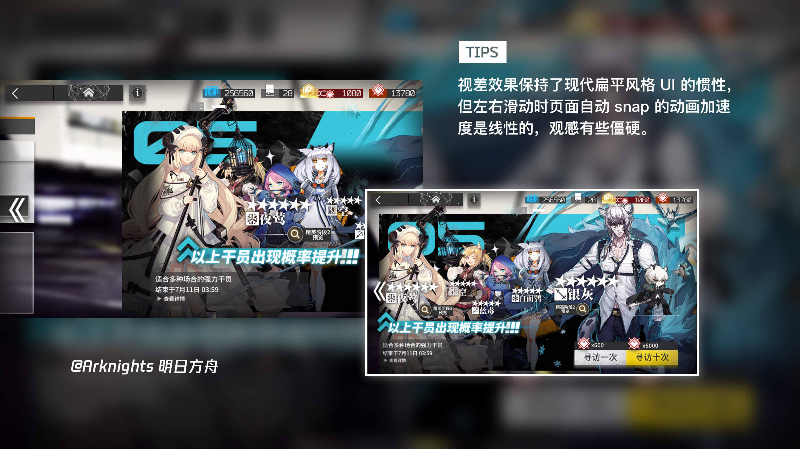

* * *

# **四. 风格化的装饰字体如何同时成功地表达古典骑士精神与科幻军工风？**

第一印象中，方舟页面明显的特点是使用了大量的衬线字体，但实际上衬线体并不是游戏内最被广泛使用的字型。在主面板中，衬线体更多以中文衬线体的方式出现，因其笔画显著的粗细差异而具有相当的可读性，以「警戒」字型的意向与悬浮视窗、以及远景中的工厂格纳库风插画形成一种统一的工业感联系。

这种设计风格在同类的《少女前线》中也有同样的呈现，后者甚至因其背景特点而更加依赖这种字型所带来的复古金属感，也正是这类似的设定让很多玩家拿到方舟后大呼面板的设计因制作人海猫的特殊经历而与少前密切相关。

**当衬线体被用于拉丁文体时，风格的变化会更加严谨一些，因而使用需要作出区分。** 它的出现可以追溯到古罗马时期，经过不断的发展演绎至今，风格区分因人而异，笔者喜欢分为以下四种基础类型：

  * _**Roman, Renaissance (Old-Style), Transitional, Modern**_

在整体的变化中，衬线和比划之间的粗细差别越来越大，字肩的弧度切角越来越平直，背后体现了刻字技术的专精细致，排印风格由传统的手写转为现代印刷的过度脉络。从这个发展路径可以看出，**衬线拉丁体其实样式丰富，「衬线字体代表了古典、严谨；无衬线字体则代表了现代」的准则有所偏颇。** 著名的 Modern 衬线字型如 Didot, Bodoni 等充满了锐利的现代感的同时，保留了精致的衬线装饰，是时尚行业偏爱的选择。

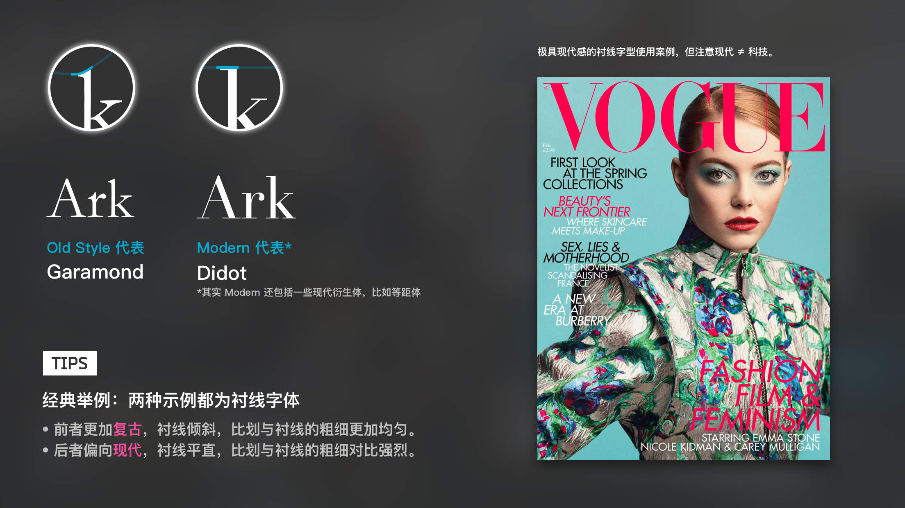

笔者非常喜爱作战章节选择页面，里面五个章节的主题图宛如唱片封面。局部失焦和高亮的 Color Dodge 图案水印，结合古典的衬线字型显得别有韵味。**但即使如此，这五幅图片仍能反映出方舟设计风格的部分不统一。**

序章、第一章、第二章三张主题图的英文字体使用和后面两章存在明显的不同 —— 以第一章为例，经多个 OCR 工具的交叉检验和笔者的经验，「EVIL TIME」 选择了衬线与笔画粗细相差极大的 Source Han Sans（CJK 对应即思源宋体，典型的 Modern 衬线体），这种偏现代的衬线字样古典感稍有不足，感觉是为了配合「黑暗时代」标题的粗细而刻意妥协的结果。

加上背景人物塔露拉的衣着有着经典欧洲皇室装束褶饰领的设计、其使用冷兵器的武器风格... 现代向的字型就进一步显得格格不入。最终让画面异物感最强烈的，便是最下方的两行俄语「ЧЕРНОБОГ | УРСУС ИМПЕРИЯ」（即 Chernobog | Ursus Empire [切尔诺伯格 | 乌萨斯帝国] ），**字型圆润而粗大，大幅度挤占画面空间，并彻底脱离了乌萨斯标志所透露出的庄重和威严感。**

**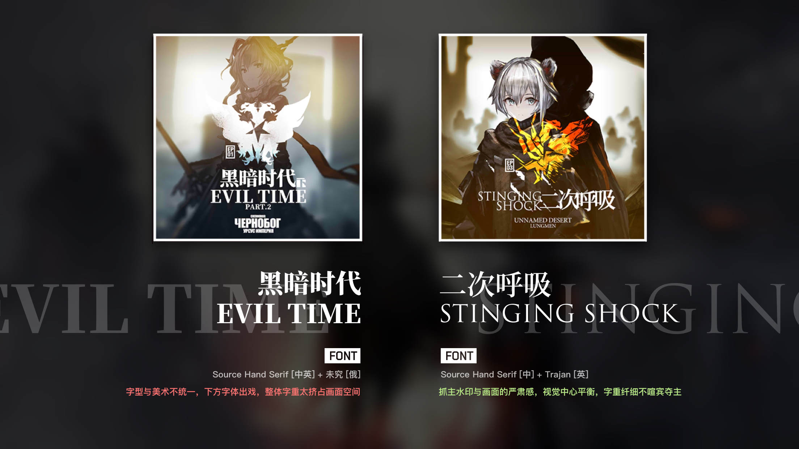**

在后续的两个章节主题图以及方舟第一个带新内容的活动「骑兵与猎人」KV 中，**拉丁文选择了****Trajan****这种更偏向于 Old Style****风格的字体，且字距缩进，中文字重进一步调低，无论是协调性还是和插画的匹配度都提升了不少。**

笔者后来回顾了下早在 2017 年方舟一测之前就流出的部分素材，估计当时的 VI 设定是用现代字型（甚至是无衬线）来匹配科技先进、光怪陆离的移动城市龙门，而用较为古典的字型来搭配切尔诺伯格和乌萨斯等建制城邦。这个设计理念在即将推出的第五章剧情 PV 中可以管中窥豹 —— 在以龙门作为核心舞台的章节里，复古的骑士短暂落幕，代表了赛博风格的点阵、无人机、精钢和无衬线字体开始活跃。

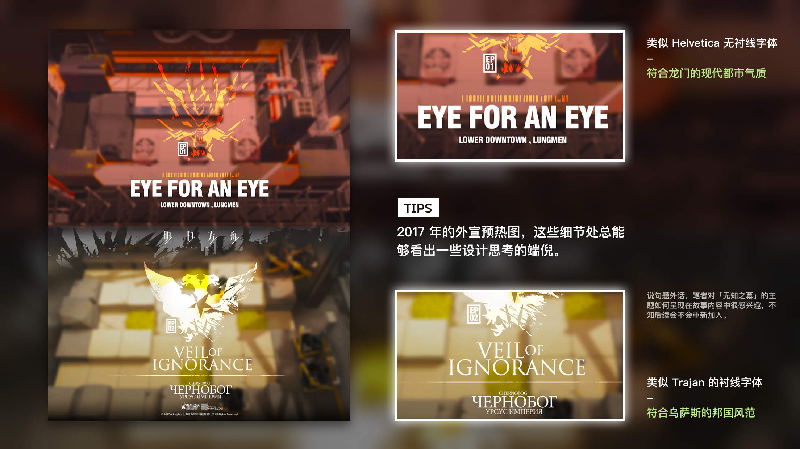

在基建系统中常见的工业风伪等距字体 Bender 也是方舟中比较有特色的字体之一（「伪」是因为其看上去很像现代等距体，但实际只有少部分字符是等距的），它的加入让整个基建系统的科技风格硬核了不少，要不然玩家真的以为在玩「天灾避难所」（笑）。

**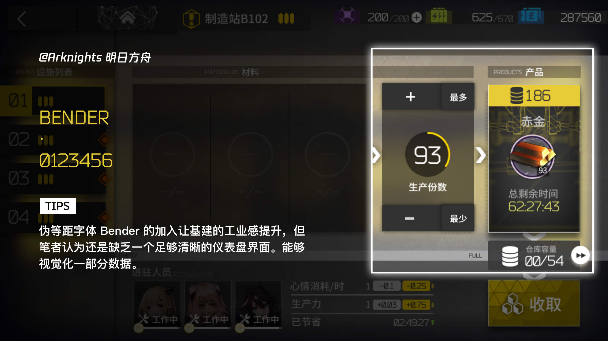**

最后想谈一下中英结合的设计手法。以笔者自身的经验，中英（或多语言）一起进行文本搭配设计总能够比较「好看」，**在多数场景为装饰考虑。原因大致是字型的变化多样而不单调、且异域文字的组合给人一种莫名的逼格****** —— 这可能是源于幼年时期我们接触到的带多语言文本的商品多是进口的稀有物资（如日本的零食或者医院里面的吊针药包），所以潜移默化地植入了这种认知；再加上科幻启蒙小说和电影多源自国外，把西文和「科技感」进行联想是再正常不过的事情。

方舟在大量的的组件内都加入了英文内容，无论是在界面层面的装饰性文本，还是在各类基础美术资源中的设计，无处不在凸显硬派风格。各类量剂和药品的描述与插图更是把 [**SCP****基金会临床文风**](<http://www.scp-wiki.net/>) 氛围铺垫到相当不错的程度。在这样的配置下，目前的剧情对白展开，显得刻意又无力，丝毫没有塑造人物个性的能力，仅仅为过场所用，亟待改善。

* * *

# **五. 焦距控制和底图处理等平面设计基础手法如何塑造统一的视觉识别？**

关于页面深度的探讨，前文已经有所提及，叙述更多是基于扁平化页面组件之间的层级关系和交互透视感。在此之外，方舟还通过焦距控制和使用统一风格化底图处理方式来在静态设计层面**加大页面深度（画面多层级）和内容深度（传达信息）的表现。**

先举一个页面之外的例子：以第一次进入采购中心时可露希尔的介绍插画为例，在光线的设置上，用亮度溢出的背景中心搭配人物插画本身的光影处理，辅以多束散射的横光，来在一个平面中表现有多个光源存在的立体空间；在元素的重叠上：多个处在人物前后的装饰文本突出元素彼此之间的立体关系；最后在焦距的控制上：通过失焦的背景凸显画面中心，又在部分前景元素上做更多的边缘失焦处理，让人物前后的纵深得到了体现。

笔者认为，Out of focus foreground framing（前景模糊取镜）自 iPhone 的人像模式推出之后便得到了快速的普及，现在已经成为了大家日常拍照的惯用手法，**大众接受度提高让设计师在处理「模糊」这一增强效果时有了更多游刃有余的空间。**

**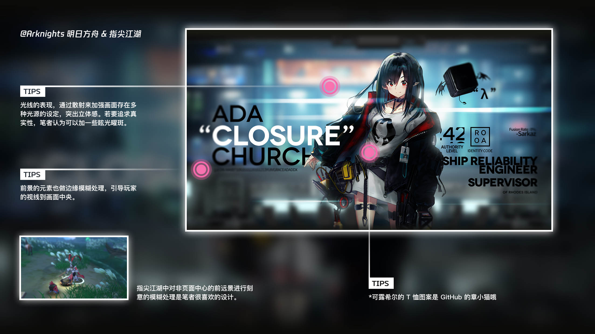**

元素的重叠和丰富页面表现是平面设计中最基础也是最无法避开的一环。不同的信息层分拣在不同的位置，**核心始终是突出主体，使之与整体****VI****更加统一** 。常见的局部覆盖、色块透明度处理、淡阴影的浮雕效果等方法在方舟的界面中屡见不见，比较有特点的则是：

  1. > 噪点与漫画网点纸风格的底图处理方法，增强画面细腻度，并见诸所有视觉出口；

  2. > 局部不稳定马赛克化，营造出带梗的信息暗示，为故事做铺垫。

根据笔者一些看漫画素描书的依稀记忆，网点纸应该是有多种类型的，比如各类花纹或者背景专用的浅色灰阶。目前方舟用得较多的设计是散点和条纹，前者相当于 Grain effect（噪化效果）的低密度高颗粒度版本，用在基础组件（如按钮上）可以使留白不显得单薄，用在各类卡片的背景或者平面设计的底图中则能够提升对比度；后者主要指粗条纹，类似警戒线的风格展现设计的工业感。**这种底图处理风格在游戏内外均以惊人的统一性被使用。**

**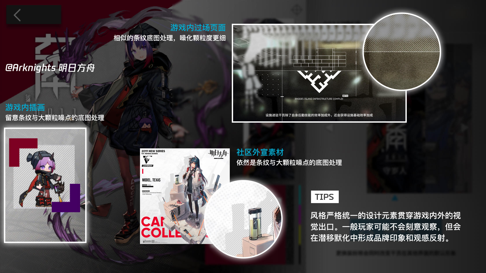**

在干员报道的界面（动态）、剿灭作战背景地图（静态）等地方均可以找到局部马赛克化的设计，**不少注意到的玩家应该可以立刻反应出「失去同步」这个已经有十年历史的梗。** 在《刺客信条》的艾吉欧三部曲中，每当出现人物记忆模糊或者连接不稳定的设定情况，场景便会进入类似的状态。综合方舟加载游戏时所提到的「释放神经递质...建立连接」、阿米娅的背景故事和 PV 信息等线索，笔者估计玩家实际上并不在游戏中扮演博士自身，而是作为独立的个体，利用系统接入博士的记忆中（正如戴斯蒙德利用 Animus 进入先祖的记忆片段中一样，metagame）。在此笔者不做过多猜想，期待后续的剧情延展。

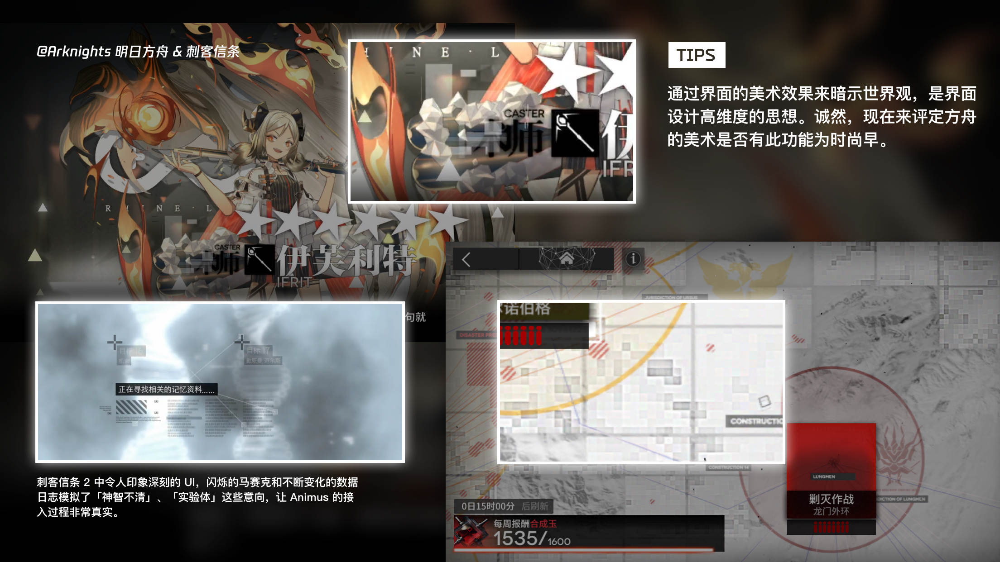

综合来说，**方舟有着非常严格的视觉规范和鲜明的品牌特点** ，这是统一埋入极具风格化的视觉单元、并严格把控所有素材出口的结果。**平面设计风格是一个不断进化的增量过程** ，在最新的章节资料片预告中，已经可以看到许多新的元素被陆续加入，但依然可以找到原有风格的演变点。

* * *

# **六. 有哪些过场衔接技巧降低了页面层级的数量，并构建了场景化的系统结构？**

这一部分主要包括三方面，以此来探究方舟是如何通过减少页面的层级和切换次数，以及在必要时提供合适的捷径，来让用户对系统的学习成本降到最低。我们知道方舟在三测期间口碑暴跌，其中一个核心槽点就是新手引导的时候扎堆灌输各种系统玩法，让玩家在序章还没有打完的时候就必须掌握 15 种打法、认识 7 种货币和近百种材料。这部分属于新手引导的节奏设置问题，我们暂时不谈，仅仅专注在界面的设计上。它们是：

  1. > 过场衔接动画体现页面的自然切换逻辑；

  2. > 风格化的堆叠浮窗与局部位移减少页面层级；

  3. > 全局物品导航和系统功能外的空间联系。

> 方舟在每一个需要进行页面切换的地方都加入了过场动画，并且根据页面之间的实际逻辑针对性地对动画效果进行了选择。如两个较为独立的系统之间使用简单的深色淡出，**而有逻辑联系的关卡主题和关卡选择之间则有明显的****zoom-in zoom-out****效果。** 进入基建等需要一定时间加载资源的系统时，除了动画效果还会展示插画，减少玩家的感知等待时间。

上文叙述毛玻璃背景模糊效果时提到，方舟常常用背景模糊覆盖浮窗的方式来降低玩家对忽然跳出的新页面的抗拒感，一些较为次级的系统直接通过在原有页面之上呼出的形式提升玩家对页面导航的把控。例如签到、邮件、通知、设置等页面的呼出都是在原页面之上进行了覆盖；在基建系统里，则通过设施的主题色来进一步增强页面的从属关系。

**除了浮窗，某元素的局部位移来形成新的信息展示空间也是常见的简化信息层级的交互方式，最经典的例子就是干员的养成页面** —— 里面每一个可以点击的按钮都没有引导至一个完全崭新的页面，而是多少保持着和干员信息页的联系：升级 - 横移淡入动画、升阶 - 人物位移、合卡 - 人物位移、升技能 - 页面背景不变、查看天赋 - 弹出透明浮窗、查看职业详情 - 弹出毛玻璃弹窗、查看属性详情 - 数值直接向右展开、查看背景故事 - 人物位移、查看时装 - 弹出毛玻璃弹窗... 再加上页面拖拽滑动可以直接实现干员的切换，**玩家在复杂的养成系统中一直没有离开过同一张****canvas****，笔者认为这是方舟交互最为典范的界面之一。**

**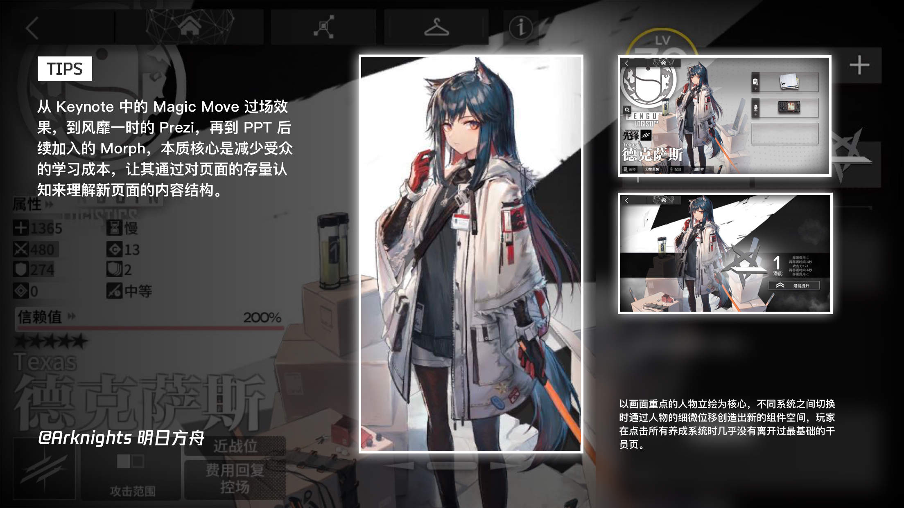**

最后提一下系统导航，主要分为两部分：

  1. > 全局捷径；

  2. > 系统场景化包装。

第一部分主要针对复杂的材料树几乎不可能让玩家记住每种物品的等级和产出途径的问题。相比于做一个独立的游戏内图鉴，游戏加入了全局指示链功能，在任何一个物品 icon 出现的地方查看物品详情都可以直接跳转到对应的掉落关卡和查看对应的掉落几率，**这种组件化的设计极大地降低了玩家对于养成科技树的学习成本，甚至在不需要完全摸清楚材料层级关系前就可以进行收集和养成了。**

第二部分则是页面左上角的主界面按钮，玩家可以通过这个导航快速进入任何一个系统中，而不需要进行枯燥的返回面板再进入。这个导航栏独特的地方是它的系统并不是零散的，而是被放置在「罗德岛」这个建立在倒悬鲸骨之上的「方舟」的不同区域，**通过赋予各系统一种空间上的联系与包装，使玩家的交互路径更加具有代入感，产生沉浸的游戏记忆** 。

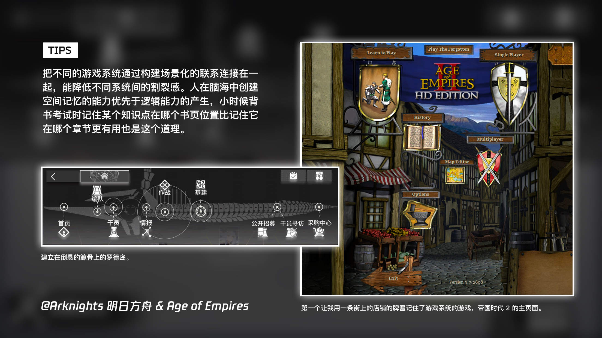

* * *

# **七. 对于页面与交互的未来展望**

一个精心雕琢的产品值得更多的回望和遐想，在此笔者也希望提出几点关于方舟的界面交互在未来的提升空间。以下都是单纯站在体验的角度提出的建议，没有加入可行性考量，不足为训。

  1. **界面元素对玩家的操作反馈待提升**

对玩家持续而稳定的刺激是保证其游戏心流的重要基础，对于非局内页面以偏静态呈现为主的方舟来说，在视觉层面提供足够持续的刺激和交互的的双向反馈有一定困难。方舟的一个解决方案是在界面中加入了大量明显的粒子效果来烘托页面细节，比如面板右上角光线的变化，管道中溢出的烟雾，飘散的尘埃和雪花，以及部分地图内表示天灾的弥散光影等 —— 此举下画面的呼吸感得到了增强，提升了游戏的整体品质。

但粒子效果贴图不受玩家的操作输入而产生变化，最后的观感仿佛是在欣赏精致生动的电影，而非体验一个交互丰富的游戏。**如果粒子效果可以随着玩家的操作输入而有所变化** ，例如在章节选择界面中，对章节卡片的拉动可以改变部分尘埃的飞行路线，产生阻挡和撞击效果，整体反馈感将会增强许多。

  2. **页面交互方式的多样性有提升空间**

页面关系和系统连接之间的顺滑一定程度上掩盖了方舟在人机交互方式选择上的保守。对按钮的点击操作是最泛用和常规的交互模式，但存在体验单调的问题。**现代产品设计中诸多新的尝试，例如拖拽、旋钮、缩放、配套的****haptic****效果、甚至是多指或屏幕边缘的操作，在非局内的多数静态页面中被使用到的情况比较有限。**

其实方舟的设计风格非常适合嵌入更现代的交互方式，在干员列表和基建系统这类使用了大量传统 GUI 组件的系统中尤其如此。几个简单的脑洞：比如在编队管理页面中允许拖拽卡片来改变干员的编排位置和出阵选择；确认贸易站订单时可以直接 swipe up/down 接受或删除该订单卡片并配合一定的缩放效果动画；调整制造站的制作量时，使用旋钮或者 slider 组件的交互便捷性会远超目前 [max + - min] 的经典 4 picker 模式。诸如此类，都是优化交互节奏、改善目前单纯靠点击操作而产生的粘滞手感的一些可能。

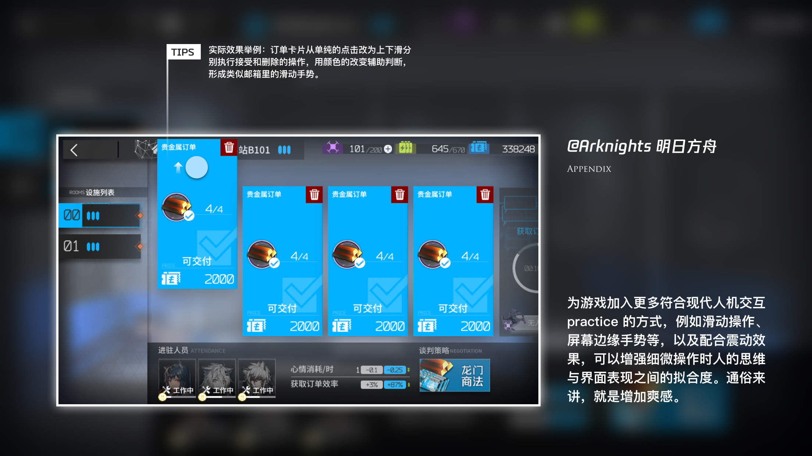

**3\. 其他一些有趣的发现**

芯片搜索任务卡片上的 caption 是「Motor Learning | Powered by DeepMentality™」，Motor Learning（技能学习）理论是认知学研究框架中的核心，它探讨了个体学习一项技能时的心理结构、场景介入因素、影响效能的行为、以及先天性的能力缺乏等问题。无论是对复杂机体能力的学习（如运动、使用乐器）还是对持续性的身体应激反应调整都有系统性的拆解分析。

有趣的是，在机器学习算法和脑机接口技术成熟的未来，传统认知理论思想或许将被迁移融合，人类机体对新技能的掌握过程被无限缩短，甚至可能通过「插入芯片」来实现。在此联想开来：**游戏设定干员升阶需要芯片这种材料，但这个项目的名称还是被定义为****Motor Learning****而非 Machine Learning****，背后蕴含了对人体边界的探讨 ——****在截肢义体改造、药化电子脑盛行的科幻未来中，人类通过自身意志形成的行为认知，会剩下多少呢？**

诚然，方舟是一款结合了部分经典文学意向作为背景考据的二次元游戏，题材更偏向废土而非赛博朋克。后者自身蕴含的时代先锋性，在一个地外与未来的温床中，应该能做出更多关于跨域种族、性别和人类意识的思考。笔者也因此对明年的《赛博朋克2077》期待万分。

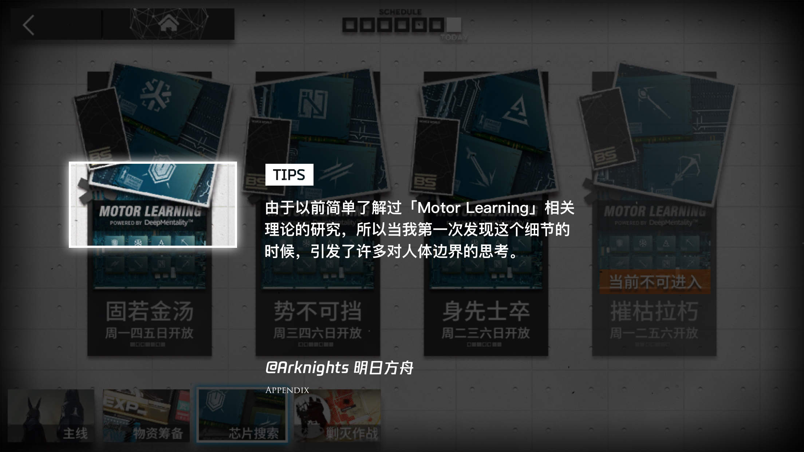

* * *

# **结语**

明日方舟是手游领域内非常罕见、有着极高美术质感追求和高度统一视觉规范标准的产品，辅以观察和拆解，可以发现藏在「好看」背后先进的设计理念。引用阿福学长的话，它的成功绝对不是一次爆冷或者偶然。方舟在运营和受众捕捉层面已经有足够的案例值得分析学习，其页面与交互最终也要成为一个好玩法的载体。虽然不会成为主角，但依旧有不可取代的作用。

界面于笔者而言，是连接系统逻辑与人的意志输入之间唯一的纽带和窗口。我们看到的每一个像素点，眼球每次细微的转动，手指的每一个操作，都依赖界面传达信息输入，并期待其返还我们意料之中的结果。发展至今，我们看到了《荒野大镖客》电影模式中完全「去 UI 化」的界面思想，也能看到《女神异闻录 5》一样把界面作为其美术风格的核心演绎环节的极端案例。**人机交互的进步，是对人类感知触点（****sensual touch point****）和信息处理能力的不断探索，会在未来更加多样化、更加精巧。**
